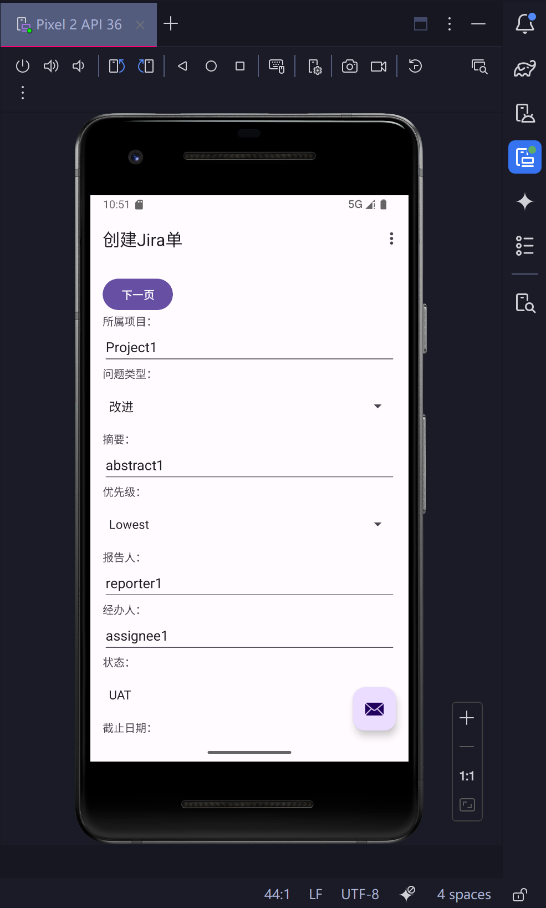
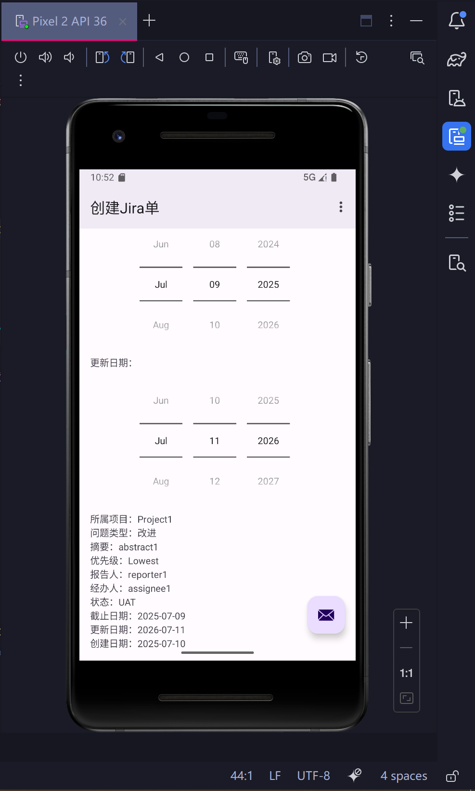
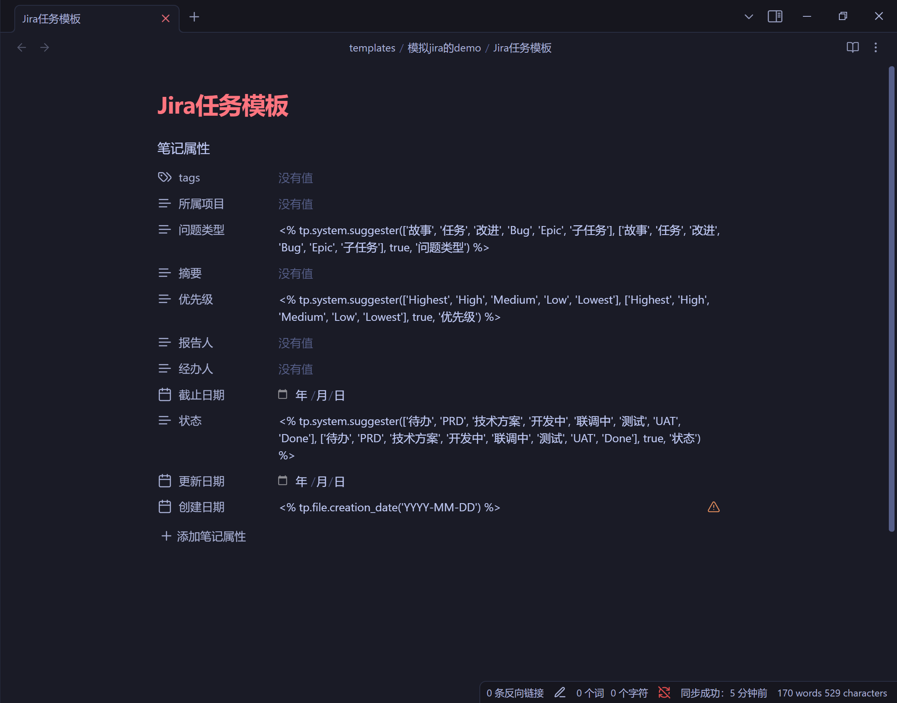

[TOC]

## 引言

这是一个 Android 开发 Hello World 项目。

> My first Android project, which has 3 fragments and allows pagination

## 运行效果


点击“新条目”后：


## 开发过程

编辑layout文件夹下用来布局的xml时，我完全用不习惯 Android Studio 那个编辑器，所以我是用 VSCode 来直接编辑xml的。我们主要改了`app\src\main\res\layout\fragment_second.xml`，并新增了`app\src\main\res\layout\fragment_third.xml`。下面仅以`app\src\main\res\layout\fragment_second.xml`为例，其他两个xml类似。

```xml
<?xml version="1.0" encoding="utf-8"?>
<androidx.core.widget.NestedScrollView xmlns:android="http://schemas.android.com/apk/res/android"
    xmlns:app="http://schemas.android.com/apk/res-auto"
    xmlns:tools="http://schemas.android.com/tools"
    android:layout_width="match_parent"
    android:layout_height="match_parent"
    tools:context=".SecondFragment">

    <androidx.constraintlayout.widget.ConstraintLayout
        android:layout_width="match_parent"
        android:layout_height="match_parent"
        android:padding="16dp">

        <Button
            android:id="@+id/button_second"
            android:layout_width="wrap_content"
            android:layout_height="wrap_content"
            android:text="@string/previous"
            app:layout_constraintBottom_toTopOf="@id/textview_second"
            app:layout_constraintEnd_toEndOf="parent"
            app:layout_constraintHorizontal_bias="0.127"
            app:layout_constraintStart_toStartOf="parent"
            app:layout_constraintTop_toTopOf="parent" />

        <Button
            android:id="@+id/button_second2"
            android:layout_width="wrap_content"
            android:layout_height="wrap_content"
            android:text="@string/next"
            app:layout_constraintBottom_toTopOf="@id/textview_second"
            app:layout_constraintEnd_toEndOf="parent"
            app:layout_constraintHorizontal_bias="0.91"
            app:layout_constraintStart_toStartOf="parent"
            app:layout_constraintTop_toTopOf="parent"
            app:layout_constraintVertical_bias="0.0" />

        <TextView
            android:id="@+id/textview_second"
            android:layout_width="wrap_content"
            android:layout_height="wrap_content"
            android:layout_marginTop="16dp"
            android:text="@string/text_page_2"
            app:layout_constraintBottom_toBottomOf="parent"
            app:layout_constraintEnd_toEndOf="parent"
            app:layout_constraintStart_toStartOf="parent"
            app:layout_constraintTop_toBottomOf="@id/button_second" />
    </androidx.constraintlayout.widget.ConstraintLayout>
</androidx.core.widget.NestedScrollView>
```

即使不看任何官方文档或教程，我们搜对应的字符串id，也不难发现字符串在`app\src\main\res\values\strings.xml`配置：

```xml
<resources>
    <string name="app_name">Multi Frag Hw</string>
    <string name="action_settings">设置</string>
    <!-- Strings used for fragments for navigation -->
    <string name="first_fragment_label">第一个页面</string>
    <string name="second_fragment_label">第二个页面</string>
    <string name="third_fragment_label">第三个页面</string>
    <string name="next">下一页</string>
    <string name="previous">上一页</string>

    <string name="text_page_1">
        第一页的文本
    </string>
    <string name="text_page_2">
        第二页的文本
    </string>
    <string name="text_page_3">
        第三页的文本
    </string>
</resources>
```

为了实现新的翻页能力，需要在`app\src\main\res\navigation\nav_graph.xml`修改项目原来已经生成的翻页逻辑。

```xml
<?xml version="1.0" encoding="utf-8"?>
<navigation xmlns:android="http://schemas.android.com/apk/res/android"
    xmlns:app="http://schemas.android.com/apk/res-auto"
    xmlns:tools="http://schemas.android.com/tools"
    android:id="@+id/nav_graph"
    app:startDestination="@id/FirstFragment">

    <fragment
        android:id="@+id/FirstFragment"
        android:name="com.example.helloworld.FirstFragment"
        android:label="@string/first_fragment_label"
        tools:layout="@layout/fragment_first">

        <action
            android:id="@+id/action_FirstFragment_to_SecondFragment"
            app:destination="@id/SecondFragment" />
    </fragment>
    <fragment
        android:id="@+id/SecondFragment"
        android:name="com.example.helloworld.SecondFragment"
        android:label="@string/second_fragment_label"
        tools:layout="@layout/fragment_second">

        <action
            android:id="@+id/action_SecondFragment_to_ThirdFragment"
            app:destination="@id/ThirdFragment" />
        <action
            android:id="@+id/action_SecondFragment_to_FirstFragment"
            app:destination="@id/FirstFragment" />
    </fragment>
    <fragment
        android:id="@+id/ThirdFragment"
        android:name="com.example.helloworld.ThirdFragment"
        android:label="@string/third_fragment_label"
        tools:layout="@layout/fragment_third">

        <action
            android:id="@+id/action_ThirdFragment_to_SecondFragment"
            app:destination="@id/SecondFragment" />
    </fragment>
</navigation>
```

最后在java文件修改对应的事件监听函数即可。我们仅以`app\src\main\java\com\example\helloworld\SecondFragment.java`为例，其他两个Fragment类似。

```java
public class SecondFragment extends Fragment {
    public void onViewCreated(@NonNull View view, Bundle savedInstanceState) {
        super.onViewCreated(view, savedInstanceState);

        binding.buttonSecond.setOnClickListener(v ->
                NavHostFragment.findNavController(SecondFragment.this)
                        .navigate(R.id.action_SecondFragment_to_FirstFragment)
        );

        binding.buttonSecond2.setOnClickListener(v ->
                NavHostFragment.findNavController(SecondFragment.this)
                        .navigate(R.id.action_SecondFragment_to_ThirdFragment)
        );
    }    
}
```

### 进阶1：使用Snackbar：新增两个反馈弹框

`app\src\main\res\menu\menu_main.xml`新增一个可供点击的条目：

```xml
<menu xmlns:android="http://schemas.android.com/apk/res/android"
    xmlns:app="http://schemas.android.com/apk/res-auto"
    xmlns:tools="http://schemas.android.com/tools"
    tools:context="com.example.helloworld.MainActivity">
    <item
        android:id="@+id/action_settings"
        android:orderInCategory="100"
        android:title="@string/action_settings"
        app:showAsAction="never" />
    <item
        android:id="@+id/action_new_item"
        android:orderInCategory="200"
        android:title="@string/action_new_item"
        app:showAsAction="never" />
</menu>
```

顺带`app\src\main\res\values\strings.xml`新增字符串：`<string name="action_new_item">新条目</string>`。

`app\src\main\java\com\example\helloworld\MainActivity.java`新增：

```java
    @Override
    public boolean onOptionsItemSelected(MenuItem item) {
        // Handle action bar item clicks here. The action bar will
        // automatically handle clicks on the Home/Up button, so long
        // as you specify a parent activity in AndroidManifest.xml.
        int id = item.getItemId();

        //noinspection SimplifiableIfStatement
        if (id == R.id.action_settings) {
            View rootView = binding.getRoot();
            Snackbar.make(rootView, "设置选项被点击了~", Snackbar.LENGTH_LONG)
                    .setAction("确定", null)
                    .show();
            return true;
        }

        if (id == R.id.action_new_item) {
            Snackbar.make(binding.fab, "新条目被点击了~通知出现位置和邮箱图标被点击时一致", Snackbar.LENGTH_LONG)
                    .setAnchorView(R.id.fab)
                    .setAction("确定", null)
                    .show();
            return true;
        }

        return super.onOptionsItemSelected(item);
    }
```

### 进阶2：熟悉常用表单控件：实现一个简单的Jira表单

效果：





我在obsidian用templater插件写过一个Jira单的demo，如下：



我们在此实现一个类似上图的简单的Jira表单。这次将会用到：

- EditText
- DatePicker
- Spinner

我主要是看[参考链接3](https://www.xinbaoku.com/archive/0Aa3CxC6.html)熟悉它们的用法。我首先手打了前4个字段的代码，如下（`app\src\main\java\com\example\helloworld\FirstFragment.java`）：

```java
package com.example.helloworld;

import android.os.Bundle;
import android.text.Editable;
import android.text.TextWatcher;
import android.view.LayoutInflater;
import android.view.MotionEvent;
import android.view.View;
import android.view.ViewGroup;
import android.widget.AdapterView;
import android.widget.ArrayAdapter;
import android.widget.Spinner;
import android.widget.TextView;

import androidx.annotation.NonNull;
import androidx.fragment.app.Fragment;
import androidx.navigation.fragment.NavHostFragment;

import com.example.helloworld.databinding.FragmentFirstBinding;

public class FirstFragment extends Fragment {

    private FragmentFirstBinding binding;
    private static final String[] questionTypeOptions = new String[] { "故事", "任务", "改进", "Bug", "Epic", "子任务" };
    private static final String[] priorityOptions = new String[] { "Highest", "High", "Medium", "Low", "Lowest" };

    @Override
    public View onCreateView(
            @NonNull LayoutInflater inflater, ViewGroup container,
            Bundle savedInstanceState) {

        binding = FragmentFirstBinding.inflate(inflater, container, false);
        return binding.getRoot();

    }

    private void setupSpinnerListeners(Spinner spinner, ArrayAdapter<String> adapter, TextView textView,
            String fieldName) {
        spinner.setOnItemSelectedListener(new Spinner.OnItemSelectedListener() {
            @Override
            public void onItemSelected(AdapterView<?> parent, View view, int position, long id) {
                String text = fieldName + "：" + adapter.getItem(position);
                textView.setText(text);
                parent.setVisibility(View.VISIBLE);
            }

            public void onNothingSelected(AdapterView<?> arg0) {
                String text = "None";
                textView.setText(text);
                arg0.setVisibility(View.VISIBLE);
            }
        });

        spinner.setOnFocusChangeListener((v, hasFocus) -> v.setVisibility(View.VISIBLE));
    }

    public void onViewCreated(@NonNull View view, Bundle savedInstanceState) {
        super.onViewCreated(view, savedInstanceState);

        binding.buttonFirst.setOnClickListener(v -> NavHostFragment.findNavController(FirstFragment.this)
                .navigate(R.id.action_FirstFragment_to_SecondFragment));

        binding.projectBelongTo.addTextChangedListener(new TextWatcher() {
            @Override
            public void beforeTextChanged(CharSequence s, int start, int count, int after) {

            }

            @Override
            public void onTextChanged(CharSequence s, int start, int before, int count) {
                String text = "所属项目：" + binding.projectBelongTo.getText().toString();
                binding.projectBelongToText.setText(text);
            }

            @Override
            public void afterTextChanged(Editable s) {

            }
        });

        ArrayAdapter<String> questionTypeAdapter = new ArrayAdapter<>(requireActivity(),
                android.R.layout.simple_dropdown_item_1line, questionTypeOptions);
        questionTypeAdapter.setDropDownViewResource(android.R.layout.simple_spinner_dropdown_item);
        binding.questionType.setAdapter(questionTypeAdapter);
        setupSpinnerListeners(binding.questionType, questionTypeAdapter, binding.questionTypeText, "问题类型");

        binding.jiraAbstract.addTextChangedListener(new TextWatcher() {
            @Override
            public void beforeTextChanged(CharSequence s, int start, int count, int after) {

            }

            @Override
            public void onTextChanged(CharSequence s, int start, int before, int count) {
                String text = "摘要：" + binding.jiraAbstract.getText().toString();
                binding.jiraAbstractText.setText(text);
            }

            @Override
            public void afterTextChanged(Editable s) {

            }
        });

        ArrayAdapter<String> priorityAdapter = new ArrayAdapter<>(requireActivity(),
                android.R.layout.simple_dropdown_item_1line, priorityOptions);
        priorityAdapter.setDropDownViewResource(android.R.layout.simple_spinner_dropdown_item);
        binding.priority.setAdapter(priorityAdapter);
        setupSpinnerListeners(binding.priority, priorityAdapter, binding.priorityText, "优先级");
    }

    @Override
    public void onDestroyView() {
        super.onDestroyView();
        binding = null;
    }

}
```

然后让DeepSeek仿照着生成剩下的代码：

```markdown
大佬，你是一名专家安卓工程师，精通安卓App项目研发全流程。请叫我hans7。我有一个安卓项目，请参考现有的 app\src\main\java\com\example\helloworld\FirstFragment.java 和 app\src\main\res\layout\fragment_first.xml ，帮我继续往下添加以下字段：

- 报告人：EditText
- 经办人：EditText
- 截止日期：DatePicker
- 状态：Spinner。选项有：['待办', 'PRD', '技术方案', '开发中', '联调中', '测试', 'UAT', 'Done']
- 更新日期：DatePicker

以上字段都包含一个对应的TextView控件。另外，还需要在最底下增加一个TextView控件，“创建日期”，自动填充初始值为当前日期。

## 实现要求

1. 遵循Don't Repeat Yourself原则，封装重复代码。
2. 仍然使用目前的布局方式：`androidx.constraintlayout.widget.ConstraintLayout`
```

生成代码的质量还是不错的，但是这个提示词忘记强调最小改动原则之类的，所以生成的代码还是不能全部复制过来。另外，还遇到了一个报错：“Call requires API level 26 (current min is 24): android.widget.DatePicker#setOnDateChangedListener”我问了DeepSeek，拿到了下面的代码：

```java
    private void setupDatePickerListener(DatePicker datePicker, TextView textView, String prefix) {
        // 初始化日期显示
        updateDateText(datePicker, textView, prefix);
        
        // 设置点击监听器（兼容所有API版本）
        datePicker.setOnClickListener(v -> {
            updateDateText(datePicker, textView, prefix);
        });
        
        // 为日期选择器的每个部分添加监听
        try {
            ViewGroup picker = (ViewGroup) datePicker.getChildAt(0);
            for (int i = 0; i < picker.getChildCount(); i++) {
                View child = picker.getChildAt(i);
                if (child instanceof NumberPicker) {
                    ((NumberPicker) child).setOnValueChangedListener((pickerView, oldVal, newVal) -> {
                        updateDateText(datePicker, textView, prefix);
                    });
                }
            }
        } catch (Exception e) {
            // 备用方案：使用轮询（不推荐但作为后备）
            datePicker.postDelayed(() -> updateDateText(datePicker, textView, prefix), 100);
        }
    }
```

对比原版：

```java
    private void setupDatePickerListener(DatePicker datePicker, TextView textView, String prefix) {
        // 初始化日期显示
        updateDateText(datePicker, textView, prefix);

        datePicker.setOnDateChangedListener((view, year, monthOfYear, dayOfMonth) -> {
            String dateStr = prefix + "："
                    + String.format(Locale.getDefault(), "%d-%02d-%02d", year, monthOfYear + 1, dayOfMonth);
            textView.setText(dateStr);
        });
    }
```

复杂多了。实测这段代码是有bug的，用不了。并且还考虑到在 https://apilevels.com/ 里查到，API Level 26的机子已经占94.8%，决定还是直接改`app\build.gradle.kts`的`minSdk`为26。

```kotlin
android {
    namespace = "com.example.helloworld"
    compileSdk = 35

    defaultConfig {
        applicationId = "com.example.helloworld"
        // Call requires API level 26 (current min is 24): android.widget.DatePicker#setOnDateChangedListener
        minSdk = 26
        targetSdk = 35
        versionCode = 1
        versionName = "1.0"

        testInstrumentationRunner = "androidx.test.runner.AndroidJUnitRunner"
    }
}
```

但我的夜神模拟器是Android 7，只能去更新模拟器了。[下载地址](https://tw.bignox.com/)。

## 打包前修改打包配置

我没有安卓基础，所以问了DeepSeek。提示词：“大佬，你是一名专家安卓工程师，精通安卓App打包流程。请叫我hans7。请问我该如何修改build.gradle.kts，使得打包出的App的文件名是multi-frag-hw-${buildType.name}-v${versionName}，并使得它在手机上显示App名为Multi Frag Hw？然后请告诉我如何打包App。”

在`app\build.gradle.kts`修改生成的APK的文件名：

```kotlin
    // 修改APK文件名
    applicationVariants.all {
        val variant = this
        val buildType = variant.buildType
        val version = variant.versionName

        variant.outputs
            .filterIsInstance<com.android.build.gradle.internal.api.BaseVariantOutputImpl>()
            .forEach { output ->
                output.outputFileName = "multi-frag-hw-${buildType.name}-v${version}.apk"
            }
    }
```

以及在`app\src\main\res\values\strings.xml`修改`<string name="app_name">Multi Frag Hw</string>`。

## 如何打包

根据[参考链接1](https://www.cnblogs.com/R-bear/p/18076127)，找到Build -> Generate Signed Bundle or APK -> 勾选APK。点击Next，首次打包需要创建证书，后续可以使用已创建好的证书。在创建证书界面设置keystore：


下一步，指定apk生成路径。我们选择release版本，点击Create创建APK文件。


## gradle打包APK相当慢！如何配置国内镜像？

[参考链接2](https://maven.aliyun.com/mvn/guide)，TODO

## 参考资料

1. 【Android】使用Android Studio打包APK文件： https://www.cnblogs.com/R-bear/p/18076127
2. 阿里云云效maven： https://maven.aliyun.com/mvn/guide
3. 下拉框Spinner参考代码： https://www.xinbaoku.com/archive/0Aa3CxC6.html
